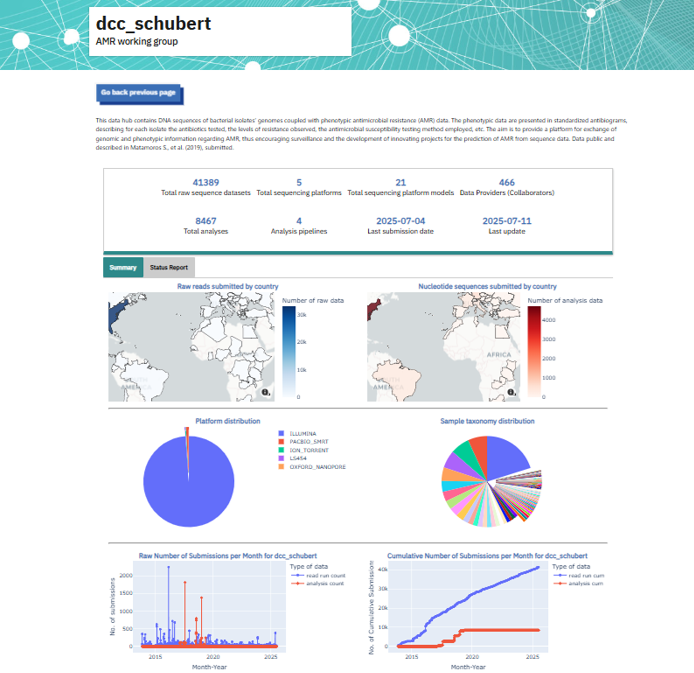
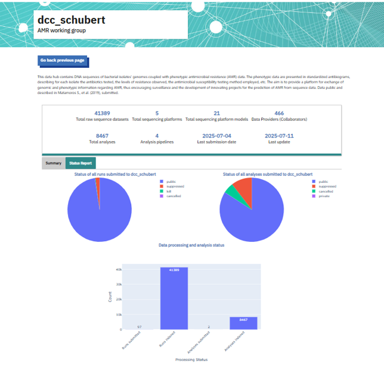

===================
Data Hub Dashboard
===================

The Data Hub Dashboard displays summary statistics and plots of data held across all public and private projects linked to a Data Hub of interest listed in the `Explore page <https://www.ebi.ac.uk/ena/datahubs/active-datahubs>`_ . This includes aggregate data statistics relating to data type, sequencing platform, as well as plots showing, e.g. an overview of sample taxonomy distribution or data submission frequency. This can all be found under the ‘Summary’ tab of the dashboard (Figure 1). 

**Figure 1**. View of the ‘Summary’ tab of the Data Hub Dashboard for an AMR related Data Hub. The overview box at the top displays summary statistics, while data visualisations are shown below, such as the distribution of sample records by type of *S.enterica* strain.

The ‘Status Report’ tab of the dashboard (Figure 2) presents a breakdown of the statuses of different data types (i.e public, private, suppressed, etc.), as well the submission and indexing status of submitted data.

**Figure 1**. View of the ‘Status Report’ tab of the Data Hub Dashboard for an AMR related Data Hub. Data visualisations on this page relate to an overview of statuses per data type and submission and indexing status.

The dashboard can be accessed by simply clicking on the name of the Data Hub from the `Explore page <https://www.ebi.ac.uk/ena/datahubs/active-datahubs>`_ 
