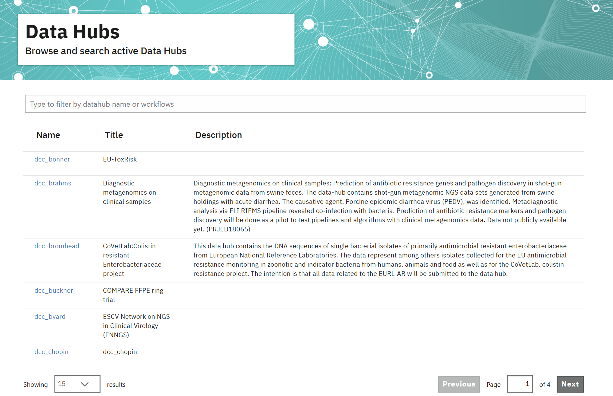

===================
The Explore Page
===================

The `Explore page <https://www.ebi.ac.uk/ena/datahubs/active-datahubs>`_ allows you to view a list of all active Data Hubs -i.e those that have had data submitted to them within the past six months - that exist in ENA. 
The page presents brief information for each Data Hub, registered by different co-ordinators, and you can search amongst these by Data Hub name (Figure 1). 
Logging in with credentials is not required, and the page is accessible to all users.

**Figure 1**. ‘Explore’ tab view displaying list of all active Data Hubs in ENA. (Note that for some Data Hubs a description was not provided at set-up).

You can click on the name of any Data Hub to view a dashboard showing an overview of all data holdings therein. See the `Data Hub Dashboard page <dashboard.rst>`_ for more information.

.. toctree::
   :maxdepth: 1
   :caption: Explore Subpages

   dashboard
