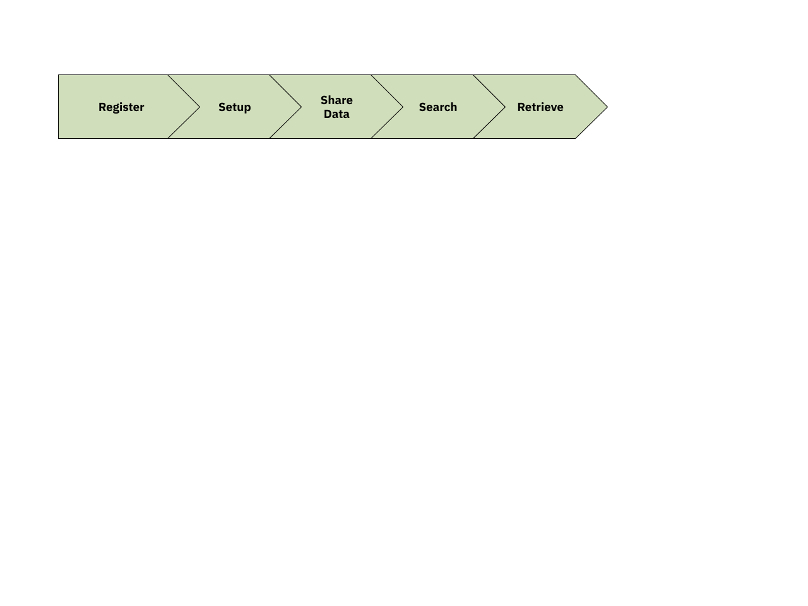
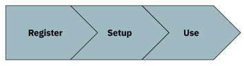

===========================
ENA Data Hubs Documentation
===========================

Welcome to documentation related to guidelines and usage of the ENA Data Hubs and the `ENA Data Hubs Portal <https://www.ebi.ac.uk/ena/datahubs/>`_.

---------------------------
What are the ENA Data Hubs?
---------------------------

The ENA Data Hubs are a workspace and set of tools that enable users to share, analyse, visualise, search and retrieve their sequence data at the ENA. It enables collaboration amongst a group of defined users on their data, in both public and private (pre-release) modes, and is configurable to specific tools and components. This enables users to prepare and release their publication and data when required.

The ENA Data Hubs are extensions to the `COMPARE Data Hubs <https://academic.oup.com/database/article/doi/10.1093/database/baz136/5685390>`_ and `SARS-CoV-2/Pathogen Data Hubs <https://doi.org/10.1099/mgen.0.001188>`_ - both providing specific use-cases for food-borne, SARS-CoV-2 and other infectious disease outbreaks, respectively.

**Figure 1.** A typical workflow for setting up an ENA Data Hub. Note that Registration is required prior to Setup, however beyond this, the order of activities does not have to be sequential.

----------------------------------
What are the different user roles?
----------------------------------
There are 3 unique roles available in ENA Data Hubs, a summary is provided in table 1:

* **Coordinator**: This is the single point of contact for the data hub and the person with the most privileges (similar to an admin). They are usually the person who has requested the ENA Data Hub and can add/remove users, add/remove workflows and update basic information about the ENA Data Hubs.
* **Data provider**: These are users who will contribute data to the ENA Data Hubs. They will have permission to link their projects (containing data) to the ENA Data Hub.
* **Data consumer**: These users will have read-only access to the data held in the ENA Data Hub, and can only use data in ways that are agreed upon by the data providers.

**Table 1.** User roles in ENA Data Hubs and what the roles encompass.

+-------------+-------------+-------------+-------------+-------------+
|             | Query and   | Link data   | Add/Remove  | Update      |
| User Role   | Download    | to Data     | users       | title and   |
|             | Data        | Hubs        |             | description |
+=============+=============+=============+=============+=============+
| Coordinator |      Y      |      Y      |      Y      |      Y      |
|             |             |             |             |             |
+-------------+-------------+-------------+-------------+-------------+
| Data        |      Y      |      Y      |      N      |      N      |
| Provider    |             |             |             |             |
+-------------+-------------+-------------+-------------+-------------+
| Data        |      Y      |      N      |      N      |      N      |
| Consumer    |             |             |             |             |
+-------------+-------------+-------------+-------------+-------------+

By default, all data querying and download is carried out using ENA Data Hub credentials (e.g. dcc_XXXXX). Coordinators and data providers must login using their Webin submissions account credentials (e.g. Webin-XXXXX) for their associated privileges as mentioned in table 1.

------------------------------
The Data Hub Life Cycle Policy
------------------------------
The ENA Data Hubs include a life cycle policy that consists of three separate statuses which define the life cycle of usage for an ENA Data Hub.

1. **Active**: This is the default state for an ENA Data Hub that has been setup. An ENA Data Hub will remain in the Active state so long as there has been data submitted to an associated private project in the previous 6 months.
2. **Dormant**: If, after 6 months, an ENA Data Hub's private projects have had no data submitted to them and those projects are public or set to go public within 6 months, the status becomes dormant. A dormant ENA Data Hub can be moved back to Active if it receives submissions during this period. Submissions to associated public projects will not alter the ENA Data Hub’s state.
3. **Recycled**: If no intervention is made by the coordinator after an ENA Data Hub has been placed in the Dormant state, the status is updated to Recycled after 90 days. In this state, all associations to Webin accounts and projects will be removed and the password will be changed to lock out old users. The ENA Data Hub can be assigned to a different set of users in the future, thus entering the life cycle again.

--------------------------
How to get an ENA Data Hub
--------------------------

**Figure 2.** Steps for users to obtain an ENA Data Hub.

To obtain a Data Hub:

1. **Register** interest in a Data Hub. Here a prospective coordinator completes a registration form. This will include questions related to what the Data Hub will be used for and how many users would be associated with it. Once approved, a Data Hub is assigned and the prospective coordinator can move on to the next step.
2. **Setup** the Data Hub. The coordinator must include descriptions of the Data Hub and link users to the Data Hub. Users will automatically receive credentials.
3. **Use** the Data Hub. Fig.1 expands on this stage for an example use-case. Overall data can be linked (at the ENA Project level) to the Data Hub, and therefore associated users. Data can also be queried and retrieved once linked to the Data Hub.

.. toctree::
    :caption: ENA Data Hub Usage
    :maxdepth: 2

    register
    manage
    share
    retrieval
    explore
