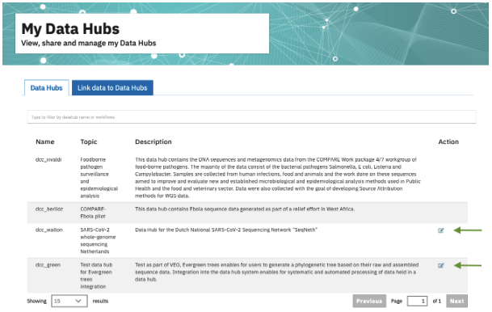
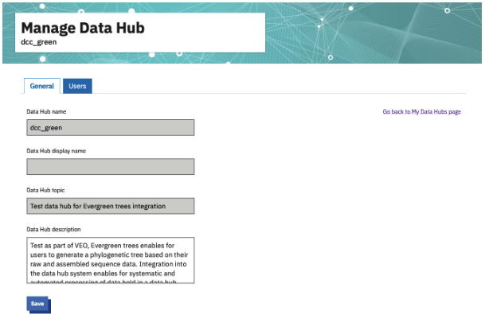

===================
Data Hub Management
===================

This page provides specific guidance to coordinators of Data Hubs. As the coordinator of an ENA Data Hub, you have control over many settings, which can be managed through the `ENA Data Hubs Portal <https://www.ebi.ac.uk/ena/datahubs/>`_.

After logging into the Data Hubs Portal, navigate to the ‘Manage’ tab (or click on the ‘My Data Hubs’ card). Here you will be presented with a list of Data Hubs that you are associated with.

Where you have coordinator permissions on a Data Hub, you will see an edit icon in the ‘Action’ column (figure 1).

**Figure 1**. ‘Manage’ tab view displaying Data Hubs associated with your login. The edit menu highlighted by green arrows indicates which data hubs you have coordinator privileges for.

From these menus, you can begin to manage your Data Hub settings:

* **General**: view Data Hub names/topic, add display name, or update description
* **Users**: view and add users, and update their roles

**Figure 2**. Data Hub management ‘General’ submenu. Basic Data Hub information can be seen and edited here.

----------------
Coordinator Role
----------------
By requesting a new Data Hub, a coordinator agrees to handle overall management of the Data Hub. This includes, and is not limited to:

* Providing appropriate Data Hub or data descriptions.
* Managing what users are added or removed from the Data Hub.
* Defining user roles for the Data Hub.
* Being the main point of contact for ENA regarding the Data Hub.
* Being the main point of contact for users of the Data Hub.
