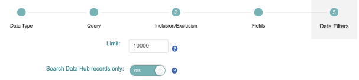

====================
Search and Retrieval
====================

This page details instructions to search and retrieve data shared to the ENA Data Hubs. This builds on the ENA’s General Guide on `ENA Data Retrieval <https://ena-docs.readthedocs.io/en/latest/retrieval/general-guide.html>`_. Searching data involves creating queries to view matching data records. This is separate to retrieval which includes methods to download data records. Both have been described below.

.. note::
    💡  Search and retrieval is carried out using **Data Hub credentials, e.g. dcc_XXXX**.

--------------
Searching Data
--------------
The ENA Data Hubs enable users to search data:
* Interactively through Advanced Search in the ENA Data Hubs Portal.
* Programmatically through the ENA Portal API.

Both methods enable users to search across public and their own private (pre-release) data, either separately or in combination. In order to later download data, ensure that search results include fields related to file download links (e.g. ‘submitted_ftp’ or ‘fastq_ftp’).

^^^^^^^^^^^^^^^^^^^^^^^^^^^
Interactive Advanced Search
^^^^^^^^^^^^^^^^^^^^^^^^^^^
Advanced Search can be found here: https://www.ebi.ac.uk/ena/datahubs/search. If you would like to view any pre-release data, ensure that you have logged in with Data Hub credentials - e.g. dcc_XXXX.

You must specify a ‘Data Type’ prior to structuring the query. For more information on Advanced Search, including how to structure your queries, see detailed documentation here: https://ena-docs.readthedocs.io/en/latest/retrieval/advanced-search.html.

^^^^^^^^^^^^^^^^^^^^^^^^^^^
Programmatic ENA Portal API
^^^^^^^^^^^^^^^^^^^^^^^^^^^
There is a `Swagger interface <https://www.ebi.ac.uk/ena/portal/api/swagger-ui/index.html>`_ detailing all of the available endpoints and their options, but most users will use the /search endpoint. For complete documentation on the Portal API, see `here <https://docs.google.com/document/d/1CwoY84MuZ3SdKYocqssumghBF88PWxUZ/edit?tab=t.0>`_.

^^^^^^^^^^^^^^^^^^
Query Construction
^^^^^^^^^^^^^^^^^^
Many different types of data and fields can be queried using the Portal API. To help to construct your query, you can use `Advanced Search <https://www.ebi.ac.uk/ena/datahubs/search>`_. From here, you can select different data types, construct data filters, set result limits and select custom field sets. Once you have made your selections, click on the ‘Copy Curl Request’ button at the bottom right of the screen. This will provide users with a command without authentication, which you can modify to add Data Hub settings and authentication.

Paste your `curl` command into an editor. We will need to add some extra fields to the query to ensure it fetches data from your Data Hub:
1. Append the following to the `-d` section of your command:
.. code-block::
    &dataPortal=ena&dccDataOnly=true&limit=0
2. At the end of the command, add authentication using the `-u` flag:
.. code-block::
    -u 'dcc_user:dcc_password'

.. note::
    💡  Use limit=0 to return all results

^^^^^^^^^^^^^^^^^^^^^^^^^^^^
Search Data Hub Records Only
^^^^^^^^^^^^^^^^^^^^^^^^^^^^
To view only Data Hub records, ensure that you specify to view Data Hub records only. In Advanced Search, this is specified through the toggle under section 5 - ‘Data Filters’, as shown in fig.1. Alternatively through ENA Portal API, specify `dccDataOnly=true` in your query, an example to fetch all raw read data held in a Data Hub has been included below.

**Figure 1**. Section 5 (‘Data Filters’) in Advanced Search in the Data Hubs Portal. This presents a toggle regarding whether a user would like to see only Data Hub records, or view Data Hub records alongside any public ENA records that match the overall query.

.. code-block::
    curl -X POST -H "Content-Type: application/x-www-form-urlencoded" \
        -d 'result=read_run&fields=run_accession%2Cstudy_accession%2Cfastq_ftp&dataPortal=ena&dccDataOnly=true&limit=0' \
        "https://www.ebi.ac.uk/ena/portal/api/search" \
        -u 'dcc_user:dcc_password'

---------------
Retrieving Data
---------------
To retrieve data, users must do so programmatically. File download links from search results (see Searching Data above) enable you to choose from a few methods in order to fetch the data files using the links. These include (but are not limited to):
1. `wget` example:
.. code-block::
    wget --ftp-user=dcc_name --ftp-password=dcc_password \
    ftp://ftp.dcc-private.ebi.ac.uk/vol1/…
2. `curl` example:
.. code-block::
    curl -u 'dcc_user:dcc_password' -O \
    "ftp://ftp.dcc-private.ebi.ac.uk/vol1/fastq/..."
