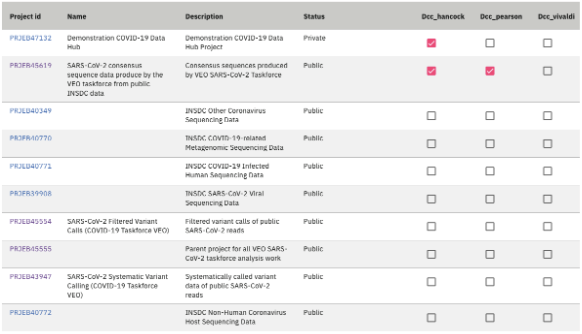

============
Sharing Data
============

This page describes how to share (or link) data to a Data Hub. This is controlled at the ENA project level (e.g. PRJXXXX) and can only be carried out by data providers or coordinators. By sharing or linking data to a Data Hub, the data provider or coordinator has agreed to share data amongst all users associated with the Data Hub.

.. note::
    💡 Data sharing is carried out using **ENA Webin credentials, e.g. Webin-XXXXX**.

---------------------
Create ENA Project(s)
---------------------
A project groups together data submitted to the archive and controls its release date and Data Hubs linkage. If you have not already done so, please follow our documentation on how to register projects: https://ena-docs.readthedocs.io/en/latest/submit/study.html.

.. note::
    💡  Existing projects can also retrospectively be linked to a Data Hub. All contents of these projects will become available through the Data Hub.

-------------------------
Link Projects to Data Hub
-------------------------
Once projects have been created, data providers can link them to the relevant Data Hubs through the Data Hubs Portal. Linking a project automatically makes everything submitted to this project available to your fellow Data Hub users.

The linking action is performed in the ‘Manage’ menu under the ‘Link data to Data Hubs’ sub-tab using a checkbox matrix (fig. 1).

.. warning::
    Note: It can take 1-3 days for data from a newly-linked project to be retrievable from a Data Hub.

----------------------
Submit Data to Project
----------------------
To make data available through a Data Hub, simply submit it to your linked project(s). For a general guide on submission to ENA, please refer to https://ena-docs.readthedocs.io/en/latest/submit/general-guide.html. It is best to familiarise yourself with the `ENA Metadata Model <https://ena-docs.readthedocs.io/en/latest/submit/general-guide/metadata.html>`_, as the Data Hubs make use of this through the linking of projects.

For further queries, please contact us at ena-data-hubs@ebi.ac.uk.

**Figure 1**. Checkbox matrix for linking projects to Data Hubs. Projects are represented as rows and Data Hub names are shown as columns.
